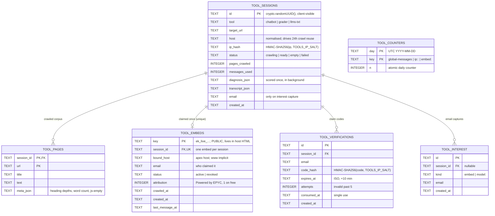

# AI Chatbot — Database ER Diagram

Cloudflare D1 (SQLite), binding `DB`, shared with the contact form.
Source of truth: `db/migrations/0003_tool_sessions.sql`, `0004_tool_embeds.sql`, `0005_tool_verifications.sql`.

## Notes

- **`tool_counters` has no FK** — keyed by string, not relation. `ip:<tool>:<hash>` points at
  `tool_sessions.ip_hash`, `embed:<key>` at `tool_embeds.key`, but neither is enforced.
  Deliberate: quota writes are a single atomic `INSERT … ON CONFLICT DO UPDATE`.
- **`tool_interest.session_id` is nullable** — an email can be captured with no session
  (model waitlist). Every other FK is `NOT NULL`.
- **Indexes**: `(host, created_at DESC)` on sessions for 24h crawl reuse;
  unique `(session_id)` on embeds; `(bound_host)` on embeds;
  `(session_id, email, created_at DESC)` on verifications.
- **Retention**: a session with a `tool_embeds` row must not be pruned — the live widget
  answers from its `tool_pages`.
- `tool` / `status` / embed `status` are CHECK constraints, not lookup tables.
